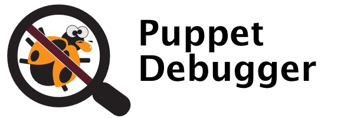

<!-- START doctoc generated TOC please keep comment here to allow auto update -->
<!-- DON'T EDIT THIS SECTION, INSTEAD RE-RUN doctoc TO UPDATE -->
**Table of Contents**  *generated with [DocToc](https://github.com/thlorenz/doctoc)*

- [puppet-debugger](#puppet-debugger)
  - [Compatibility](#compatibility)
  - [Production usage](#production-usage)
  - [Installation](#installation)
  - [Load path](#load-path)
  - [Interactive demo](#interactive-demo)
  - [Web demo](#web-demo)
  - [Usage](#usage)
  - [Using Variables](#using-variables)
    - [Listing variables](#listing-variables)
  - [Listing functions](#listing-functions)
  - [Using functions](#using-functions)
  - [Duplicate resource error](#duplicate-resource-error)
  - [Setting the puppet log level](#setting-the-puppet-log-level)
  - [Remote nodes](#remote-nodes)
    - [Setup](#setup)

<!-- END doctoc generated TOC please keep comment here to allow auto update -->
[](https://badge.fury.io/rb/puppet-debugger)

# puppet-debugger

A interactive command line tool for evaluating and debugging the puppet language.

## Documentation
Please visit https://docs.puppet-debugger.com for more info.

## Compatibility
Requires Puppet 3.8+ and only uses the future parser.  Works with puppet 4-6.

## Production usage
The puppet debugger is a developer tool that should only be used when writing puppet code.  Although it might seem useful
to install on your production puppet master. Please do not install because of the puppet-debugger gem dependencies that might conflict with your existing environment.

## Installation
`gem install puppet-debugger`


## Web demo
There is a web version of the [puppet-debugger](https://demo.puppet-debugger.com) online but is somewhat
limited at this time. In the future we will be adding lots of awesome features to the web debugger.

## Usage
The puppet debugger is a puppet application so once you install the gem, just fire it up using `puppet debugger`.  
If you have used `puppet apply` to evaulate puppet code, this replaces all of that with a simple debugger REPL console.
The debugger will only parse and evaluate your code.  It will not build a catalog
and try to enforce the catalog. This has a few side affects.  This means you can type any puppet code in the debugger
and see what it would actual do when compiling a resource.

1. Type and provider code will not get run.
2. Nothing is created or destroyed on your system.

`puppet debugger`

Example Usage
```
MacBook-Pro-2/tmp % puppet debugger
Ruby Version: 2.0.0
Puppet Version: 4.8.1
Puppet Debugger Version: 0.4.3
Created by: NWOps <corey@nwops.io>
Type "exit", "functions", "vars", "krt", "whereami", "facts", "resources", "classes",
     "play", "classification", "reset", or "help" for more information.

1:>> ['/tmp/test3', '/tmp/test4'].each |String $path| { file{$path: ensure => present} }
 => [
  [0] "/tmp/test3",
  [1] "/tmp/test4"
]
2:>> 


```

## Copyright

Copyright (c) 2018 NWOPS, LLC. See LICENSE.txt for
further details.
